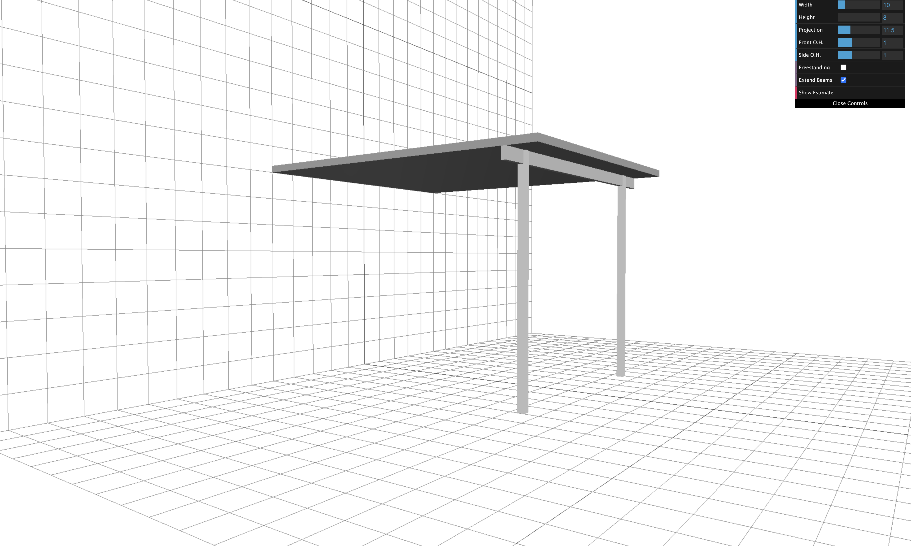

    <h1>Patio Roof Visualizer</h1>
    

        
         
        <em>A 3D interactive patio roof visualizer made using Three.JS.</em>
    

## :sparkles: Features

- Rotate, pan and zoom the 3d model to view at different angles.
- Modifiable roof width height, width and projection.
- Changeable post positions.
- Option to create a freestanding roof.
- Roof beam extension.
- Connect to an external database with materials and prices to create a price estimate for the patio roof.
- Highly customizable JSON files that control the rules for how prices are estimated and how each dimension can be changed.
